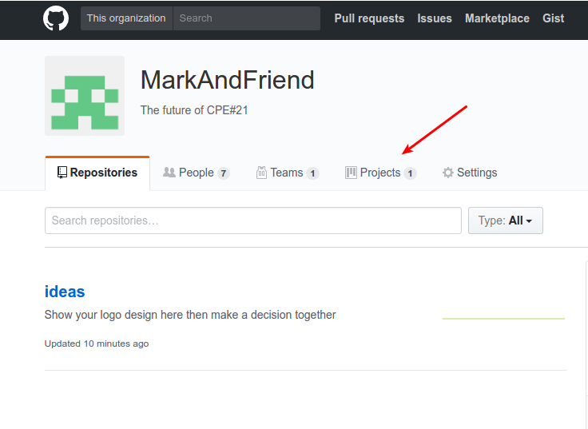
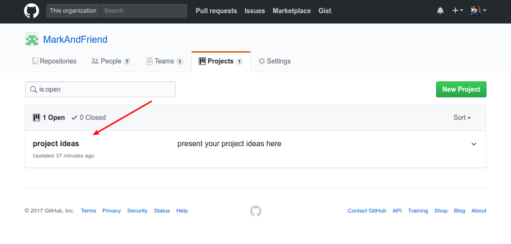
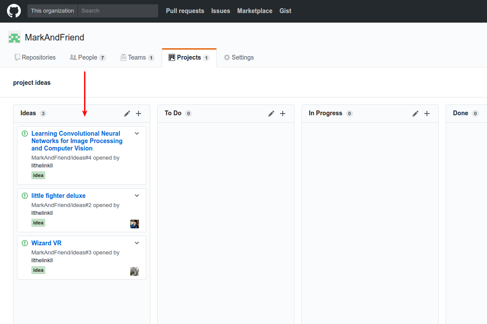

# Get Start

let get start with study How to use [github](https://try.github.io/levels/1/challenges/1) and  [Markdown](http://www.markdowntutorial.com/)(optional for write a readme)

# How to Present your ideas
1. goto project ideas  
     
     

2. present your idea
     
